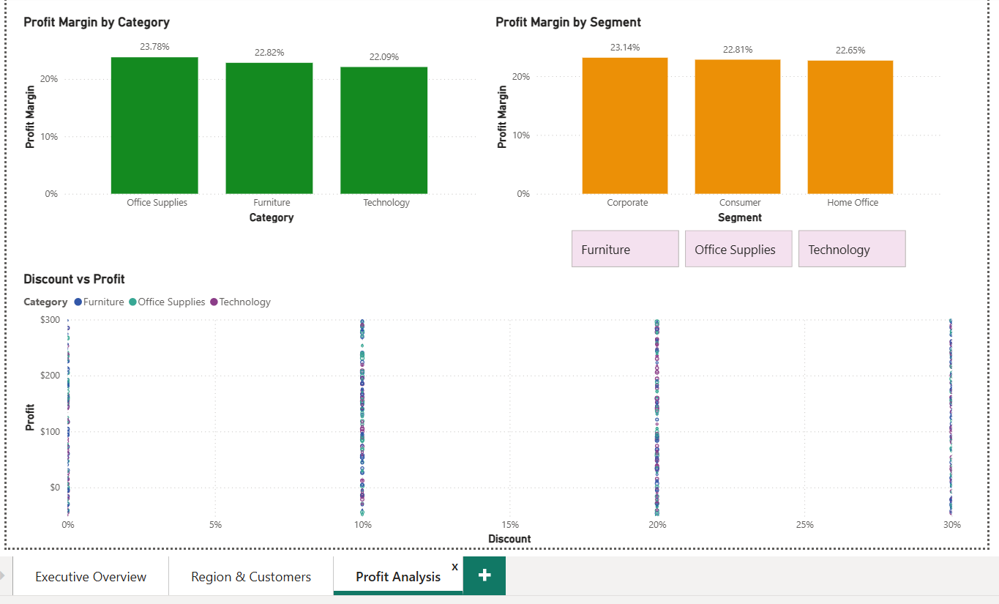

# Phase 5: Dashboard Development & Visualization 📊

**Project:** Retail Sales Analytics  
**Dataset:** Sample – Superstore  
**Objective:** Create an interactive Power BI dashboard to visualize insights from cleaned and analyzed retail sales data and support data-driven decision-making.

---

## 🖥️ Dashboard Overview

The dashboard consists of **three main pages**, each designed for a specific business perspective:

### 1️⃣ Page 1: Executive Overview (General Performance)
- **Navigation & Filters:** Left-hand sidebar with slicers for **Region**, **Category**, and **Sub-Category** for global report filtering.
- **KPI Scorecards:**  
  - Total Sales: $256.11K  
  - Total Profit: $58.58K  
  - Total Quantity: 3K  
  - Profit Margin: 22.87%
- **Time Series Analysis:** Area/Line chart for "Sales and Profit by Order Year and Month" (Jan 2021 – May 2022).  
- **Categorical Performance:** Bar & Line chart "Sales and Profit by Category" (Furniture, Office Supplies, Technology).  

## Executive Overview

---

### 2️⃣ Page 2: Region & Customers (Geographical & Loyalty)
- **Regional Breakdown:** Bar chart "Sales by Region" (West, East, Central, South).  
- **Customer Excellence:** Bar chart "Top 10 Customers by Sales" (Customer 22, Customer 3, etc.).  
- **Geographical Granularity:** Bar/Table chart "Sales by City".  
- **Product Distribution:** Sub-Category performance by region.  

## Region & Customers Analysis

---

### 3️⃣ Page 3: Profit Analysis (Efficiency & Margins)
- **Efficiency Metrics:** Bar chart "Profit Margin by Category".  
- **Segment Analysis:** Donut/Bar chart for "Profit Margin by Segment" (Consumer, Corporate, Home Office).  
- **Profit vs. Sales Comparison:** Charts highlighting high-sales but low-margin areas to identify inefficiencies.  

## Profit Analysis

---

## ⚙️ Technical Design Elements
- **Unified Theme:** Professional blue & white color palette for readability.  
- **Cross-Filtering:** All visuals interconnected; selecting a region updates all relevant charts instantly.  
- **Sidebar Navigation:** Consistent layout across all pages for improved UX.  
- **Derived Fields:** Profit Margin, Order Year/Month, Order Quarter, etc., for trend and KPI analysis.

---

## 📂 Power BI File Placement

The Power BI report file is included in the repository for download:

---

## ✅ Phase 5 Outcome
- Fully interactive Power BI dashboard displaying KPIs, trends, and insights.  
- Supports management decisions on branch performance, customer behaviour, and profitability.  
- Consistent structure with SQL analysis and KPI calculations from Phase 4.  
- Ready for updates as new data becomes available.

---

