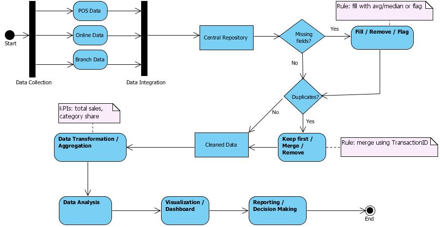

# Retail Sales Analytics Project 🛒

**Domain:** Retail Sales  
**Dataset:** Sample - Superstore  
**Objective:** Clean, analyze, and visualize retail sales data to provide actionable insights for store managers, marketing, and inventory teams.  
**Tools:** Excel, SQL, Power BI  

---

## 📌 Project Overview
This project demonstrates the end-to-end Data Analytics lifecycle in a retail context, starting from raw sales data from multiple sources and culminating in actionable insights through an interactive Power BI dashboard. The workflow covers:

- **Problem Understanding** – Identify business challenges, define goals, stakeholders, assumptions, and preliminary KPIs.  
- **Data Understanding & Assessment** – Explore dataset structure, check data quality, missing values, duplicates, and understand granularity.  
- **Data Cleaning & Preparation** – Standardize, clean, and enrich data; create derived features for analysis.  
- **KPI Calculation & Analysis** – Compute key business KPIs (Sales, Profit, Quantity, Profit Margin), analyze trends, top customers, products, and regions.  
- **Dashboard Development & Visualization** – Build an interactive Power BI dashboard for executive, regional, and profitability analysis.  

> **Note:** Duplicate rows were identified in the dataset. As there is no unique Product ID, a composite key using `Order ID` and `Product Name` was applied to remove duplicates, ensuring accurate KPI aggregation and consistent dashboard metrics.

---

## 📂 Repository Structure
```
Retail_Sales_Analytics/
├── images/
│ ├── Executive Overview.png
│ ├── Profit Analysis.png
│ ├── Region & Customers.png
│ ├── Advanced Insights.png
│ └── phase2_treemap.png
├── ActivityDiagram.jpg
├── phase1_problem.md
├── phase2_analysis.md
├── Phase3_Data Cleaning & Data Preparation.md
├── Phase4_SQL Analysis.md
├── Phase5_Insights & Recommendations.md
├── Retail_Sales_Analytics.pbix
└── README.md
```

All files are fully documented and organized for each phase of the project.

---

## 🔹 Phase Details & Highlights

### Phase 1 – Problem Understanding
- **Objective:** Address inconsistent and incomplete sales data from POS, online store, and branch systems. Enable better decision-making for managers.  
- **Stakeholders:** Store Managers, Marketing Team, Inventory Team.
- - **Activity Diagram:**  


- **Key Goals:**
  - Clean and consolidate sales data  
  - Analyze sales trends across branches and categories  
  - Identify top customers and products  
  - Provide actionable insights via dashboard  
---

### Phase 2 – Data Understanding & Assessment
- **Dataset Structure:**
  - Orders: `Order ID`, `Order Date`, `Ship Date`, `Ship Mode`  
  - Customers: `Customer ID`, Name, Segment  
  - Geography: Country, Region, State, City, Postal Code  
  - Products: Category, Sub-Category, Product Name  
  - Metrics: Sales, Quantity, Discount, Profit  

- **Observations:**
  - Minor missing values (Postal Code)  
  - Duplicate line items exist due to granularity; handled in cleaning phase  
  - Dataset ready for KPI calculation and visualization  

**Visualization:**  


---

### Phase 3 – Data Cleaning & Preparation
- **Cleaning Actions:**
  - Missing Postal Codes replaced with `"Unknown"`  
  - Trimmed whitespaces and standardized text fields  
  - Converted dates and numeric fields for analytics  
  - Validated line-item granularity for aggregation  
  - Derived fields: Order Year, Month, Quarter, Profit Margin  

- **Outcome:** Cleaned and enriched dataset ready for KPI calculation and dashboard development.

---

### Phase 4 – KPI Calculation & Analysis

**Key Highlights:**

- **Duplicate Handling:** Applied composite key (`Order ID` + `Product Name`) to remove duplicate rows, ensuring accurate KPI values in SQL and Power BI.  

#### Example KPIs:

| KPI | Value |
|-----|-------|
| Total Sales | 256,646.38 |
| Total Profit | 58,577.34 |
| Total Quantity | 2,525 |
| Average Discount | 15.6% |
| Profit Margin | 22.8% |

- **Insights:**
  - Top-selling product: Furniture – Phone  
  - High-profit but lower sales: Furniture – Bookcase  
  - Highest sales region: West; lowest: South  
  - Some customers show negative profits (returns/high discounts)  
  - Monthly trends indicate seasonal fluctuations  

- **Additional KPI Analysis:**
  - Profit Margin by Category: Office Supplies > Furniture > Technology  
  - Segment Discount Analysis: ~15% across Consumer, Corporate, Home Office  

---

### **Phase 5 – Dashboard Development & Visualization**
- **Power BI File:** [Retail_Sales_Analytics.pbix](./Retail_Sales_Analytics.pbix)  
- **Dashboard Pages:**  
  1. **Executive Overview** – KPIs, Sales & Profit trends, Category performance  
       
  2. **Region & Customers** – Sales by Region, Top 10 Customers, City-level performance  
       
  3. **Profit Analysis** – Profit Margin by Category/Segment, Profit vs Sales comparison  
     
  4. **Strategic Insights** – Logistics efficiency (Combo Chart) and Sub-Category Profitability Ranking  
     
    
---

- **Technical Highlights:**  
  - Fully interactive cross-filtering across all visuals  
  - Derived fields enable trend and KPI analysis  
  - Cleaned dataset ensures reliable visualization  
  - Professional blue & white theme for readability

---

### 📊 Key Outcomes & Strategic Insights
- **Logistics Efficiency:** First Class shipping has a lower profit margin (~21%) despite high volume; potential for cost optimization.  
- **Product Profitability:** "Bookcases" and "Chairs" identified as top-tier margin contributors.  
- **Data Integrity:** Fully cleaned and validated dataset with consistent KPI tracking between SQL and Power BI.  
- **Decision Support:** Interactive dashboard providing actionable insights for logistics, marketing, and inventory teams.  

---

### 🚀 Future Work / Phase 6
- Advanced analytics: sales forecasting, RFM customer segmentation, scenario analysis  
- Enhanced dashboard for predictive insights and operational recommendations  

---

### 📬 Contact / More Info
This project is part of my Data Analytics Portfolio.  
For inquiries or collaboration: **mojesadi@gmail.com**

> “© 2025 Mojesadi – Portfolio Project. Do not reuse without permission.”
