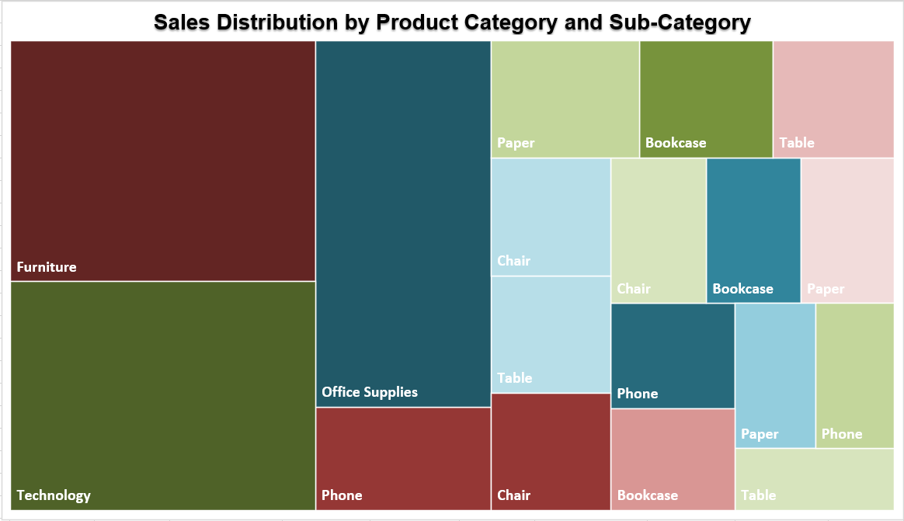

# 🔍 Phase 2 - Data Understanding & Data Assessment

## 📦 1. Dataset Overview

**Dataset Name:** Sample - Superstore  
**Domain:** Retail Sales  
**Format:** Excel  
**Granularity:** Order line-item level  

The dataset represents historical retail sales transactions. Each record corresponds to a product-level entry within a customer order. The data contains information related to orders, customers, products, geography, and sales performance metrics.

The primary objective of this phase is to understand the dataset structure, scope, and data quality before proceeding to data cleaning and transformation.

---

## 🧱 2. Data Structure Summary

The dataset consists of the following logical groups of fields:

- **🧾 Order Information:** Order ID, Order Date, Ship Date, Ship Mode  
- **👤 Customer Information:** Customer ID, Customer Name, Segment  
- **🌍 Geographical Information:** Country, Region, State, City, Postal Code  
- **📦 Product Information:** Category, Sub-Category, Product Name  
- **💰 Sales Metrics:** Sales, Quantity, Discount, Profit  

This structure supports both transactional-level analysis and aggregated reporting across multiple business dimensions.

---

## 🗺️ 3. Dataset Structure Visualization

This treemap provides a high-level visual overview of the dataset by grouping columns into logical business domains. It helps illustrate the relative composition of the dataset and supports a faster conceptual understanding of how different types of data are distributed.

*Figure 1: Treemap illustrating the dataset structure across order, customer, geography, product, and sales metric dimensions.*

---

## 📘 4. Data Dictionary

| Column Name     | Description                                      | Data Type |
|-----------------|--------------------------------------------------|-----------|
| Order ID        | Unique identifier for each customer order        | String    |
| Order Date      | Date when the order was placed                   | Date      |
| Ship Date       | Date when the order was shipped                  | Date      |
| Ship Mode       | Shipping method used                             | String    |
| Customer ID     | Unique identifier for each customer              | String    |
| Customer Name   | Customer full name                               | String    |
| Segment         | Customer segment classification                  | String    |
| Country         | Country of the transaction                       | String    |
| Region          | Sales region                                     | String    |
| State           | State name                                       | String    |
| City            | City name                                        | String    |
| Postal Code     | Postal or ZIP code                               | String    |
| Category        | High-level product category                      | String    |
| Sub-Category    | Product sub-category                             | String    |
| Product Name    | Product description                              | String    |
| Sales           | Total sales value for the line item              | Numeric   |
| Quantity        | Number of units sold                             | Integer   |
| Discount        | Discount applied to the sale                     | Numeric   |
| Profit          | Profit generated from the sale                   | Numeric   |

---

## ⚠️ 5. Missing Values Assessment

A preliminary assessment of missing values was conducted across all columns.

- Core transactional and sales-related fields are fully populated.
- Missing values are primarily observed in certain geographical attributes, such as **Postal Code**.
- No missing values were detected in critical metrics such as **Sales**, **Quantity**, or **Profit**.

**Observation:**  
Missing geographic attributes may affect location-based analysis or mapping but do not limit overall sales, profitability, or trend analysis.

---

## 🧬 6. Duplicate Records Assessment

Duplicate checks were performed at multiple levels:

- No fully duplicated rows were identified.
- Repeated **Order ID** values were observed, which is expected due to the line-item nature of the dataset (one order may contain multiple products).

**Observation:**  
Repeated Order IDs do not indicate data quality issues and should be handled correctly during aggregation and KPI calculations.

---

## 🧪 7. Data Type and Format Review

- Date fields are consistently formatted and suitable for time-based analysis.
- Numeric fields (**Sales**, **Profit**, **Quantity**, **Discount**) contain valid numeric values.
- Categorical fields show consistent labeling, though minor standardization (e.g., casing or trimming whitespace) may be required.
- **Postal Code** is stored as a string to preserve leading zeros.

---

## 🧠 8. Key Observations for Data Cleaning Phase

Based on the data assessment performed in this phase:

- Minor missing values require appropriate handling strategies.
- Categorical fields may require normalization and standardization.
- Aggregation logic must account for the line-item granularity of the data.
- The dataset is well-structured and suitable for KPI calculation, trend analysis, and dashboard development after cleaning.

---

### ✅ Outcome of Phase 2

The dataset structure, data quality considerations, and potential limitations have been identified and documented. The project is now ready to proceed to **Phase 3 – Data Cleaning & Preparation**.
